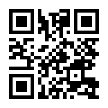
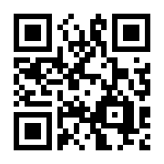
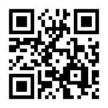
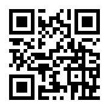

# BeBee kinder hygge hub
 

## Our location and how to get there

BeBee occupies separate private building in residential area "Sudnobudivnyk" located near Vynohradar district on the North-West part of Kyiv.  

At the moment publicly available maps are a bit outdated so the best way to meet us is to get to the main entrance of Sudnobudivnyk (2 Gazoprovidna Street).

### Navigating to BeBee

Use the following links and/or QR codes on your phone to get navigating directions to BeBee:

- from Nyvky metro station:    [is.gd/onamik](https://is.gd/onamik) 
 

- from Syrets metro station:   [is.gd/awavam](https://is.gd/awavam) 
 

- from Lavina shopping mall:   [is.gd/esoyem](https://is.gd/esoyem) 
 

- from Vynohradar:             [is.gd/ovivaj](https://is.gd/ovivaj) 
 
